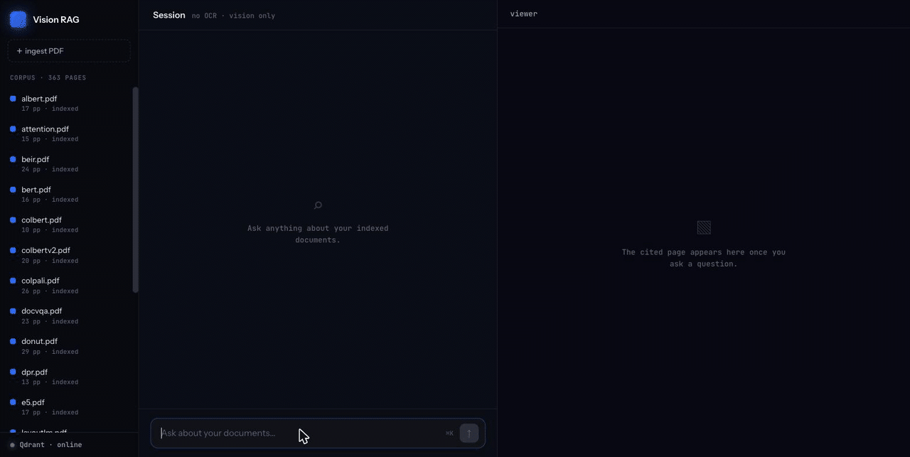
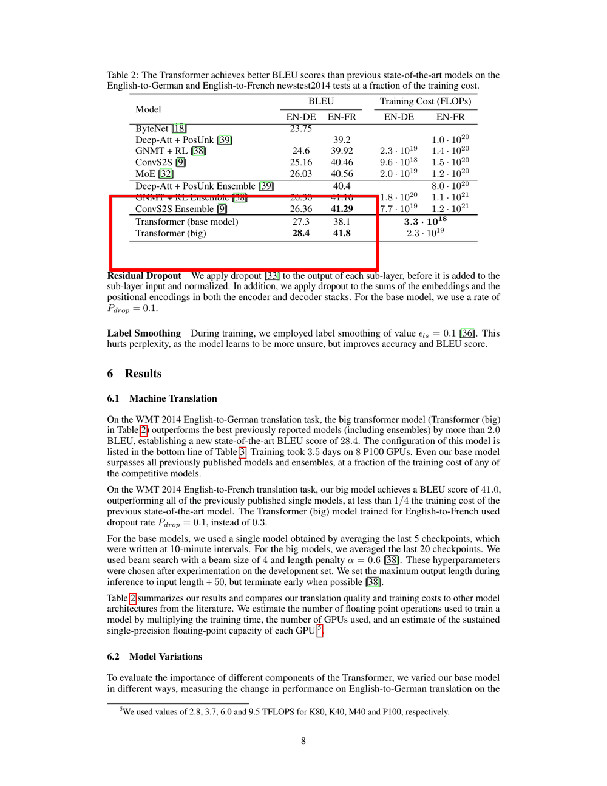
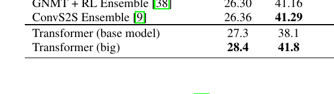

# ColPali Vision RAG

**Retrieval-augmented QA over PDFs that never reads text.** Every page is treated as an
image — no OCR, no text layer — so charts, tables and scans work the same as prose. And
every answer comes back with the exact slice of the page it was read from.



## Results

83 labeled questions over a **363-page** corpus (3 gold documents + 16 deliberately
confusable distractor papers). Full harness and methodology in [Evaluation](#evaluation).

| metric | | metric | |
|---|---|---|---|
| recall@1 / @3 / @12 | 0.671 / 0.849 / **1.000** | citation accuracy | **0.959** |
| rerank recall | **1.000** | substring accuracy | 0.958 |
| LLM-judge accuracy | **0.945** (avg score 4.85/5) | abstention accuracy | 1.000 (10/10) |
| gold-doc coverage | 0.825 *(ceiling: 0.850)* | avg latency | 19.0 s |

Read honestly: **`recall@12`, `rerank_recall` and `abstention_accuracy` are all at 1.0 with
no observed headroom in the current baseline** — three of the ten CI gates are currently
un-trippable while their configured gates remain active and can fail after regression, and
re-de-saturating the eval is an open lead. The numbers that still have room are recall@1
and gold-document coverage (`gold_coverage_avg`), and [every remaining miss for gold_coverage_avg
is a cross-document question](docs/EXPERIMENTS.md#whats-still-open).

**→ [Experiments](docs/EXPERIMENTS.md)** — every retrieval and ingest decision with its
numbers, including the rejected arms: a 2× ingest speedup turned down for what it cost
dense tables, a silent GPU kernel bug found by an equivalence gate, and a metric that was
demoted after it turned out to be measured off a single row.

---

## Contents

- [Why](#why) · [How it works](#how-it-works)
- [Quickstart](#quickstart) · [CLI usage](#cli-usage)
- [Evaluation](#evaluation)
- [HTTP API](#serving-http-api--ui) · [Auth](#auth-and-rate-limiting) · [UI](#ui-ui) · [Deployment](#deployment-docker)
- [Configuration](#configuration) · [Observability](#observability) · [Development](#development)

## Why

Vision RAG can *read* a chart, but a plain text answer ("28.4") gives the reader no way to
check it. Here the model reports **where** it looked, and the pipeline crops that region out
of the page PNG it already stored during ingestion — turning the answer into a visual,
verifiable citation.

| the cited page | the crop |
|---|---|
|  |  |

## How it works

```text
                                                            ┌─ answer text: "28.4"
question ─▶ retrieve ─▶ rerank ─▶ answer ─▶ highlight ──────┼─ crop:      page_8_crop.png      ◀─ the exact slice
           (ColQwen2   (Gemini    (Gemini,   (crop the      └─ annotated: page_8_annotated.png ◀─ box drawn on page
            + Qdrant,   picks the  structured  cited box)
             top-12)    top 3)     output)
```

1. **Retrieve** (`src/embedder.py`, `src/vector_store.py`): the query is embedded into
   ColQwen2's token-level multivectors and matched against per-page multivectors in Qdrant,
   ranked by **MaxSim**. Vectors are **binary-quantized** (128-d → 128 bits, 32× smaller) and
   held in RAM for a fast first pass; the top hits are then **rescored** against full-precision
   vectors on disk. Qdrant is asked for a wider pool (`RETRIEVE_K × CANDIDATE_FANOUT`, 24 by
   default) and up to `RETRIEVE_K` (12) validated pages come back, with no more than
   `MAX_PAGES_PER_DOC` (5) from any single PDF. That cap exists because MaxSim on a two-part
   question is dominated by whichever document matches more query tokens and will otherwise
   take *every* slot; the extra pool depth lets a capped-out slot be backfilled instead of lost.
2. **Rerank** (`src/reranker.py`): candidates go to Gemini as **downscaled thumbnails** — cheap
   triage — which returns the `RERANK_K` (3) pages that actually help. If the call fails or
   returns junk it falls back to the top pages by MaxSim score.
3. **Answer** (`src/answerer.py`): the reranked **page images** go to Gemini at full resolution,
   which returns structured JSON: the `answer`, which `source_page` it came from, and a `box` in
   Gemini's native `[ymin, xmin, ymax, xmax]` convention normalized to 0–1000.
4. **Highlight** (`src/highlight.py`): the box is converted to pixels against the real page PNG,
   padded, then **cropped** and **annotated** into `page_images/crops/`.

A two-part question is **split** before retrieval and each half searched separately, with the
rankings fused by reciprocal rank — see [query decomposition](docs/EXPERIMENTS.md#query-decomposition--adopted).

The steps are wired as a [LangGraph](https://langchain-ai.github.io/langgraph/) flow in
`src/graph.py`: `retrieve → rerank → answer → highlight`.

## Quickstart

The whole stack in one command — the UI, the API and Qdrant, on one origin:

```bash
git clone https://github.com/Akash-Sannidhanam/colpali-vision-rag.git
cd colpali-vision-rag
GEMINI_API_KEY=... docker compose up      # then open http://localhost:8000
```

Upload a PDF through the UI and ask it something. First boot downloads the ~2B ColQwen2
weights into a mounted cache; `/health` returns `503` until the model is loaded.

**Requirements:** Docker and a [Gemini API key](https://aistudio.google.com/apikey). **No GPU
needed** — device selection is CUDA → MPS → CPU automatically, and the Linux image pulls CUDA
12.8 torch wheels so `--gpus all` works when one is present.

<details>
<summary><b>Running on the host instead (for development)</b></summary>

Also needs **Python ≥ 3.13** + [uv](https://docs.astral.sh/uv/), and **Poppler** for page
rendering (`brew install poppler` / `apt-get install poppler-utils`; override with `POPPLER_PATH`).

```bash
uv sync
cp .env.example .env               # then edit GEMINI_API_KEY
docker compose up -d qdrant        # dashboard at http://localhost:6333/dashboard
```

`.env` is gitignored, so your key stays local. It holds `GEMINI_API_KEY` and
`QDRANT_URL=http://localhost:6333`. Leave `QDRANT_URL` unset to skip Docker entirely and use the
embedded on-disk store.
</details>

## CLI usage

```bash
# 1. Generate the sample PDF (a bar chart + a sales table, pure pixels, no text layer)
uv run python scripts/make_sample_pdf.py

# 2. (optional) Fetch the eval corpus — 16 arXiv papers pinned by sha256, ~320 pages
uv run python scripts/fetch_eval_corpus.py          # needed only to run eval/

# 3. Ingest: render pages → embed with ColQwen2 → store in Qdrant
PYTHONPATH=. uv run python src/ingest.py            # indexes everything in pdfs/
#   or point at specific files:  ... src/ingest.py path/to/doc.pdf
#   ingest is incremental — re-running only embeds documents whose bytes (or the
#   model / render DPI that produced them) changed, so an unchanged corpus is a no-op
PYTHONPATH=. uv run python src/ingest.py --rebuild   # force a full atomic re-index

# 4. Ask a question
PYTHONPATH=. uv run python src/main.py "What was the Q4 revenue in the chart?"
```

The repo ships a small starter corpus in `pdfs/` — the generated sales report plus two arXiv
papers (*Attention Is All You Need* and *ColPali*, ~43 pages) — so the rerank step has a real
12-candidate pool out of the box. Drop your own PDFs into `pdfs/` and re-run the ingest.

Step 2 is only needed for the eval. It adds 16 papers chosen to be *confusable* with the gold
documents, because a 43-page corpus is too small to measure retrieval on at all — see
[Evaluation](#evaluation). Those PDFs are not committed; `eval/corpus_manifest.json` pins each by
sha256 and the fetch script verifies them.

<details>
<summary><b>Example CLI output</b></summary>

```
============================================================
RETRIEVED PAGES
============================================================
sales_report.pdf- page 1 (score 13.8517)
sales_report.pdf- page 2 (score 7.9038)

============================================================
ANSWER
============================================================
180
============================================================

============================================================
SOURCE REGION
============================================================
From sales_report.pdf - page 1
crop:      page_images/crops/sales_report_page_1_crop.png
annotated: page_images/crops/sales_report_page_1_annotated.png
============================================================
```

The `crop` is a tight slice around the answer; the `annotated` page is the full page with the
region outlined. On macOS the crop opens automatically in Preview. Try
`"Which region had the highest growth?"` to hit the table page instead.

`RETRIEVED PAGES` lists the pages kept *after* reranking — retrieval pulls `RETRIEVE_K` (12)
candidates and rerank narrows them to `RERANK_K` (3).
</details>

## Evaluation

A labeled set (`eval/dataset.jsonl`, **83 questions**: 73 answerable with gold `{pdf, page}`
labels and expected-answer substrings, plus 10 unanswerable questions with no gold pages) plus a
scoring harness make regressions visible: re-run after changing `RENDER_DPI`, `RERANK_K` or a
model, and diff the JSON reports to *prove* nothing regressed. Each report carries a `config`
snapshot so two runs are comparable at a glance.

**The corpus is part of the instrument.** An earlier version of this eval scored 1.0 on recall,
rerank recall, citation accuracy, substring match *and* the judge — not because the pipeline was
perfect but because the corpus was 43 pages, so a 10-candidate retrieval returned 23% of the index
and the gold page could not fail to be in it. Every downstream metric inherited that ceiling, which
made the harness useless as a guard. `scripts/fetch_eval_corpus.py` fixes it structurally by adding
320 pages of deliberately confusable papers — the retrieval family (ColBERT, ColBERTv2, DPR, BEIR,
SPLADE, E5, RAG) carries the same late-interaction prose and nDCG tables the ColPali questions turn
on, and PaliGemma is ColPali's own base model.

```bash
# Retrieval only — recall@k against the index, no Gemini calls (runs without a key)
GEMINI_API_KEY= PYTHONPATH=. uv run python eval/run_eval.py --retrieval-only

# Full pipeline — recall@k + rerank recall + citation correctness + substring match
PYTHONPATH=. uv run python eval/run_eval.py

# …plus LLM-as-judge scoring of each answer against the reference (EVAL_JUDGE_MODEL)
PYTHONPATH=. uv run python eval/run_eval.py --judge

# CI gate: exit 1 if any watched metric drops below its floor (repeatable, one run)
PYTHONPATH=. uv run python eval/run_eval.py --judge \
  --gate recall@1:0.63 --gate recall@3:0.81 --gate recall@12:0.95 \
  --gate rerank_recall:0.95 --gate citation_accuracy:0.91 --gate substring_accuracy:0.91 \
  --gate abstention_accuracy:0.90 --gate gold_coverage_avg:0.67 \
  --gate candidate_coverage_avg:0.80 --gate judge_accuracy:0.90
```

Those floors sit ~3 questions below the pinned baseline — except `candidate_coverage_avg` and
`abstention_accuracy`, which both have approximately one-question slack (`abstention_accuracy`
has a 0.90 floor over 10 unanswerable rows). `candidate_coverage_avg` is the tightest gate for
the retrieval-only path and carries no LLM variance.

**The gate names track `RETRIEVE_K`.** The harness derives `ks = {1, 3, RETRIEVE_K}`, so a report
carries `recall@12` and no `recall@10` — an old `--gate recall@10:...` fails as a *missing metric*
rather than as a regression.

| family | question it answers |
| --- | --- |
| **recall@k** | is the gold page in Qdrant's top-`RETRIEVE_K` pre-rerank candidates? **Rerank retention** is measured separately by the reranking metrics (`rerank_recall` and the coverage family) which evaluate whether gold pages are kept through the rerank step into the top-`RERANK_K` results. |
| **citation accuracy** | did the answer's `source_page` resolve to the gold page? |
| **answer quality** | substring match, plus the optional LLM judge |
| **abstention accuracy** | on the 10 questions the corpus *cannot* answer, did it decline instead of inventing one? Its complement is the hallucination rate. |
| **gold-document coverage** | on the 20 questions whose gold spans two PDFs, did rerank spend a slot on each? Paired with **candidate coverage** one stage earlier, which is what attributes a miss to retrieval vs. rerank — and is a hard ceiling on it. |
| **calibration** | is retrieval decisiveness higher when retrieval's top page is right? Withheld below n=5. |

Each is also sliced by tag (`chart` / `table` / `figure` / `formula` / `text` / `cross-doc` /
`unanswerable`), and every metric is computed over *applicable rows only* — an unanswerable
question carries no gold page, so it scores abstention without entering a recall denominator. The
scoring logic (`eval/scoring.py`) is pure and unit-tested; the full run reuses `main.run_query`, so
it also reports per-question latency/token/cost for free.

### Trusting a run before you pin it

- **A degraded run must never become the baseline.** A run against depleted Gemini quota still
  produces a full report — and scores `abstention_accuracy` **1.0**, because a call that never
  reached the model is indistinguishable from a correct refusal. Degraded calls are counted into
  `meta.degraded_calls`; above `--max-degraded-frac` (2%) the run stamps `degraded_run`, writes
  `degraded_<utc>.json` instead, **skips the gates** and exits 2. Every report carries a
  `degradation` block even when clean — the zeros are the evidence the guard ran.
- **Compare runs question by question, not by summary average.**
  `eval/diff_reports.py BEFORE.json AFTER.json [--metric gold_doc_coverage]` joins two reports on
  row id and prints which questions flipped, improved-vs-regressed counts, and which config knobs
  differ. Audit every flipped row before calling it a regression — under-labeled gold has caused
  more apparent regressions here than the pipeline has.

### Baseline

`eval/reports/baseline_decomposed.json` is committed as the thing to diff against — 83 questions
over ~363 pages at the shipped defaults. `baseline_diverse.json` is the same 83 questions with
query decomposition off, and is what the decomposition pass was measured against.

| metric | `baseline_diverse` | **`baseline_decomposed`** (pinned) |
| --- | --- | --- |
| recall@1 | 0.7397 | 0.6712 |
| recall@3 | 0.9041 | 0.8493 |
| recall@12 | 0.9863 | **1.0000** |
| rerank_recall | 0.9863 | **1.0000** |
| citation_accuracy | 0.9315 | **0.9589** |
| substring_accuracy | 0.9444 | **0.9583** |
| judge_accuracy / score | 0.9178 / 4.78 | **0.9452 / 4.85** |
| gold_coverage_avg | 0.8250 | 0.8250 |
| candidate_coverage_avg | 0.8250 | **0.8500** |
| abstention_accuracy | 1.0000 | 1.0000 (10/10) |
| avg_latency_ms | 18049 | 18984 |

**Why both recall floors went down.** Splitting a two-part question orders the top of the slate
worse than the whole question did, so recall@1/@3 fall — and every answer-level metric rises anyway,
because `RERANK_K=3` picks from a 12-page slate and what gates the answer is whether gold is *in*
it. Retrieval-precision proxies are not answer quality, and here they moved in opposite directions.

**Read these numbers with their run-to-run variance.** Across runs of identical code, roughly two
questions' worth of judge noise is normal — `sales-q2-revenue`, where the judge rejects `$150,000`
for a chart labeled "Thousands" showing 150, has flipped across runs. That is why no LLM-dependent
gate sits closer than ~3 questions.

**One metric is deliberately withheld.** `confidence_separation` needs at least one wrong citation
to exist, and the pinned baseline has exactly one — so it was being reported to four decimals off a
single row, with earlier baselines showing the *same quantity with the opposite sign*. It is now
`null` until the eval has ≥5, and the signal is measured instead against `gold_rank`, where the
negative class is recall@1 misses (24 of them). See
[confidence calibration](docs/EXPERIMENTS.md#confidence-calibration--the-pass-that-overturned-its-own-premise).

## Serving (HTTP API + UI)

Beyond the CLI, the pipeline runs as a warm **FastAPI** service with a **React** UI on top. The
service loads the ~2B ColQwen2 model **once at startup** (not per query), so after boot every
request is warm.

```bash
# warm the model + Qdrant once, then serve on http://127.0.0.1:8000
PYTHONPATH=. uv run uvicorn src.server:app --host 127.0.0.1 --port 8000
```

Run a **single worker** — the one GPU-resident model is shared and serialized behind
`src/gpu_arbiter.py`, so `--workers >1` would load N copies and break that assumption. On startup
you see the model load once and a `server warm` log line; the live OpenAPI schema is at `/docs`.
See [Concurrency](#concurrency) for what the arbiter does that a plain lock doesn't.

| Method & path | What it does |
|---|---|
| `POST /query` `{question}` | Answer + citation (with `box`) + the used pages + crop/annotated images + a per-request `meta` (request_id, latency, tokens, cost, and a per-stage breakdown). Add `?inline=true` to also get images as base64 data-URIs (for a sandboxed UI); the default returns `/images/...` URLs. |
| `POST /heatmap` `{question, pdf, page_number}` | Per-patch **MaxSim heatmap** for one page — an `n_x × n_y` grid of query→page match strengths in `[0,1]`. Powers the viewer's **"why this page?"** toggle (which patches the query lit up, vs. the crop's *where the answer was read*). On-demand: it recomputes two forward passes on the model lock, so it's a separate call, not part of `/query`. |
| `GET /health` | `model_loaded` + Qdrant reachability + `corpus` integrity (whether any indexed document has lost its page images). `503` when Qdrant is unreachable. |
| `GET /corpus` | Indexed documents + page counts (powers the UI's corpus rail). |
| `POST /ingest` (multipart PDF) | Render → embed → index an uploaded PDF. Long-running, but it **yields the model between page batches**, so a concurrent question waits about a page rather than the whole document. Only the uploaded document is embedded; re-uploading an unchanged one is recognised and costs nothing. |
| `DELETE /corpus/{pdf}` | Remove a document completely — its vectors, page images, crops, and the stored PDF. `404` when it isn't indexed. Takes no model lock, so it stays responsive during a query or ingest. |
| `GET /images/...` | Static page / crop / annotated PNGs. |

```bash
curl -s localhost:8000/health
curl -s -X POST localhost:8000/query -H 'content-type: application/json' \
  -d '{"question":"What was the Q4 revenue in the chart?"}' | jq .answer   # "180"
```

### Auth and rate limiting

Set `API_KEY` and every endpoint above requires it in an `X-API-Key` header. **Leaving it unset
disables auth entirely**, which is the default so a local run needs no setup — the server logs a
warning at boot when it starts up open.

```bash
API_KEY=$(openssl rand -hex 24) PYTHONPATH=. uv run uvicorn src.server:app
curl -s localhost:8000/corpus                          # 401
curl -s -H "X-API-Key: $API_KEY" localhost:8000/corpus # 200
```

Two endpoints stay open by design:

- **`GET /health`** — so an orchestrator can probe liveness without holding the secret.
- **`GET /images/...`** — because `` cannot send a custom header. Page and crop PNGs are
  all it exposes, and their paths are only discoverable through an authenticated `/query`. **If your
  pages are themselves sensitive, this is the gap to close** (put the deployment behind a proxy that
  authenticates, or serve images as data-URIs with `?inline=true`).

Requests are also rate limited per client IP — a sliding window, counted in-process (the server is
single-worker by design, so one process sees everything). Exceeding it returns `429` with a
`Retry-After` header. The limit is applied **before** the key check, so unauthenticated requests are
throttled too and key guessing isn't free.

| Setting | Default | Notes |
|---|---|---|
| `SERVER_HOST` | `127.0.0.1` | uvicorn bind host (the `python src/server.py` runner) |
| `SERVER_PORT` | `8000` | uvicorn bind port |
| `API_KEY` | *(empty)* | shared secret required in `X-API-Key`. **Empty disables auth** — set it for anything reachable beyond localhost |
| `RATE_LIMIT_PER_MINUTE` | `30` | per-IP cap on the query/read endpoints; `0` disables |
| `RATE_LIMIT_INGEST_PER_HOUR` | `10` | per-IP cap on `/ingest` and `/ingest/stream`, on top of the per-minute one; `0` disables |
| `TRUST_PROXY_HEADERS` | `false` | read the client IP from `X-Forwarded-For`. Only enable behind a trusted proxy — otherwise any client can forge it and get a fresh rate-limit bucket |
| `CORS_ALLOW_ORIGINS` | `http://localhost:5173,http://127.0.0.1:5173` | comma-separated browser origins allowed to call the API; `*` allows any. Irrelevant in the Docker deployment, where the UI is served from the same origin |
| `MAX_UPLOAD_MB` | `50` | reject larger PDF uploads to `POST /ingest` |
| `GPU_WAIT_TIMEOUT_S` | `60` | how long a request may wait for the model before it is shed as `503` + `Retry-After`; `0` waits forever |
| `PAGE_IMAGES_DIR` | `./page_images` | where rendered pages and crops live. **Persist and back this up with the Qdrant storage** — see above |
| `PDFS_DIR` | `./pdfs` | where uploaded source documents are kept |
| `QDRANT_PATH` | `./qdrant_data` | on-disk location of the embedded fallback store (unused when `QDRANT_URL` is set) |

### UI (`ui/`)

A React + Vite single-page app — a three-column workspace (corpus rail · conversation · document
viewer) that renders each answer with its **visual citation**: the cited page with the bounding box
drawn over it, the cropped slice, and the reranked-candidate rail, plus a "how this was answered"
per-stage trace. A **"why this page?"** toggle on the viewer overlays the MaxSim patch heatmap (via
`POST /heatmap`), tinting the patches the query matched — the retrieval-side complement to the
answer crop.

```bash
cd ui
npm install
npm run dev            # http://localhost:5173  (expects the API on :8000)
```

That's the **dev** setup — two processes, cross-origin, which is why the API allows the Vite dev
origin via CORS. A **production build defaults to same-origin relative URLs** instead, because the
deployed shape is FastAPI serving the built bundle itself. `VITE_API_BASE` overrides either.

`npm run typecheck` and `npm run test` cover the UI's pure logic (the `citation.box → overlay` math
and 1-based page resolution); CI runs both plus the build on every PR.

### Deployment (Docker)

The `Dockerfile` packages the **API and the UI together**: a `node:22-slim` stage compiles `ui/` to
static assets, and FastAPI serves them at `/` alongside the API. One container, one origin — so
there is no separate web server to run and CORS never enters the picture. The Python side is a
multi-stage `uv` build on a slim base; on Linux it pulls the CUDA 12.8 torch wheels, so the image is
GPU-capable with `--gpus all` and **auto-falls back to CPU** when no GPU is present. Poppler is
included; it runs as a non-root user and serves on `0.0.0.0:8000`.

```bash
GEMINI_API_KEY=... API_KEY=... docker compose up   # then open http://localhost:8000
docker compose up -d qdrant                        # Qdrant only (run the app on the host)
```

`http://localhost:8000` is the whole product: the UI loads there and calls the API on its own
origin. With `API_KEY` set it prompts for the key on first load and keeps it for that browser tab
(never baked into the bundle — that JS ships to every visitor).

The image alone, if you're wiring it into something else:

```bash
docker build -t vision-rag .
docker run --rm -p 8000:8000 \
  -e GEMINI_API_KEY=$GEMINI_API_KEY \
  -e API_KEY=$API_KEY \
  -e QDRANT_URL=http://host.docker.internal:6333 \
  -v vision-rag-hf:/home/appuser/.cache/huggingface \   # persist the model download
  -v vision-rag-pages:/app/page_images \                # REQUIRED — half the corpus
  -v vision-rag-pdfs:/app/pdfs \                        # the source documents
  vision-rag                                            # add --gpus all on a GPU host
```

### The corpus is two halves, and they must persist together

The vectors in Qdrant and the rendered page PNGs in `page_images/` are **one logical
corpus**. Retrieval ranks a page by its vector and then *reads the answer off the PNG*, so a
deployment that persists one without the other is broken in a way that looks fine:
`GET /corpus` still lists every document (it reads Qdrant payloads), while every query drops
its hits for a missing image and answers "not found". No error, no 500.

Three things make that recoverable rather than a silent outage:

- **`/health` reports it.** `corpus` is `ok`, or it names the documents whose page images are
  short. The boot log carries the same at `ERROR`.
- **A plain re-ingest repairs it.** `ingest` treats a document whose page images are missing as
  stale, so `PYTHONPATH=. uv run python src/ingest.py` re-renders and re-embeds exactly those —
  it does not need `--rebuild`, and it still skips the intact ones.
- **The corpus is relocatable.** Page-image paths are stored relative to `PAGE_IMAGES_DIR`, so
  moving the directory (or restoring a backup under a different root) doesn't invalidate the
  index. Set `PAGE_IMAGES_DIR` / `PDFS_DIR` to put the data on a mounted disk.

**Back up `qdrant_storage`, `page_images` and `pdfs` as one unit.** The HF cache is not corpus
data — dropping it only costs a re-download.

### Concurrency

The server is single-worker by construction: one ColQwen2 in memory, and every GPU-touching
request serialized through `src/gpu_arbiter.py`. Two things it does beyond a plain lock:

- **An ingest yields the model between page batches.** A long upload used to hold it for the
  whole document, so a concurrent question waited minutes. It now hands the GPU to a queued
  query at each page boundary — a wait of roughly one page.
- **It sheds instead of hanging.** Past `GPU_WAIT_TIMEOUT_S` a request gets `503` with a
  `Retry-After`, the same shape as the rate limiter's `429`. And a client that disconnects
  mid-query cannot release the model out from under its own running forward pass.

First boot downloads the ~2B ColQwen2 model into the mounted HF cache (subsequent boots are warm);
`/health` returns `503` until the model is loaded and Qdrant is reachable. On a GPU host, uncomment
the `deploy.resources` block in the `app` service (needs the NVIDIA container toolkit).

**Before exposing it beyond localhost:** set `API_KEY`, keep the single worker, and terminate TLS at
a proxy in front (the app speaks plain HTTP, so an `X-API-Key` on an unencrypted hop is readable in
transit). Note the `/images` exemption described above.

## Configuration

Knobs live in `src/config.py`:

| Setting | Default | Notes |
|---|---|---|
| `QDRANT_URL` | _(unset)_ | Qdrant server URL, e.g. `http://localhost:6333`; unset falls back to the embedded on-disk store. Set in `.env` |
| `COLPALI_MODEL` | `vidore/colqwen2-v1.0` | swap to `vidore/colqwen2.5-v0.2` for higher chart/table accuracy on a bigger GPU |
| `RENDER_DPI` | `150` | page render resolution |
| `RETRIEVE_K` | `12` | candidate pages pulled from Qdrant per query |
| `RERANK_K` | `3` | pages kept after the Gemini rerank, then sent to the answer step |
| `MAX_PAGES_PER_DOC` | `5` | most slots any one PDF may hold in the candidate slate; `0` disables the cap |
| `CANDIDATE_FANOUT` | `2.0` | how much wider than `RETRIEVE_K` to fetch so capped-out slots are backfilled |
| `EMBED_VISUAL_TOKENS` | _(unset)_ | per-page visual-token budget; unset means the checkpoint's own (768). Changing it re-embeds — see [experiments](docs/EXPERIMENTS.md#visual-token-budget--rejected) |
| `RERANK_THUMBNAIL_EDGE` | `768` | long-edge px for rerank thumbnails; set `None` to rerank on full-res pages |
| `GEMINI_MODEL` | `gemini-3.5-flash` | any vision-capable Gemini model (used for both rerank and answer) |
| `RERANK_MODEL` | _(= `GEMINI_MODEL`)_ | override to point the coarser rerank triage at a cheaper/faster model |
| `EVAL_JUDGE_MODEL` | _(= `GEMINI_MODEL`)_ | model the eval `--judge` flag grades answers with |

`RETRIEVE_K`, `RERANK_K`, `MAX_PAGES_PER_DOC`, `CANDIDATE_FANOUT`, `QUERY_DECOMPOSE`,
`MAX_SUBQUERIES` and `DECOMPOSE_ORIGINAL_WEIGHT` are env-overridable and all land in the eval
report's config snapshot, so **an experiment arm is a prefix, not a code edit**.

## Observability

Every query is traceable end to end. Set `LOG_JSON=true` for one JSON object per log line (ready for
a log aggregator); each line carries a per-query `request_id`, so the
`retrieve → rerank → answer → highlight` node timings (`latency_ms`), the per-call Gemini token/cost
lines, and a final `query complete` summary all correlate. A rerank or answer step that fails
degrades gracefully **and** logs a `degraded` warning, so a silently-degraded query is still visible.
The same per-query totals — plus a **per-stage** breakdown of time, tokens and cost — are returned in
the `/query` response's `meta` field, which the UI's *how this was answered* trace renders.

**LangSmith tracing (optional).** Off by default and needs no code change. Set both
`LANGSMITH_TRACING=true` and `LANGSMITH_API_KEY` (optionally `LANGSMITH_PROJECT`) and LangGraph emits
traces natively, tagged with the same `request_id` as the logs.

| Setting | Default | Notes |
|---|---|---|
| `LOG_LEVEL` | `INFO` | stdlib log level |
| `LOG_JSON` | `false` | `true` emits one JSON object per line with `request_id` + `latency_ms` + token totals |
| `LANGSMITH_TRACING` | _(unset)_ | set `true` (with a key) to turn on LangSmith tracing |
| `LANGSMITH_API_KEY` | _(unset)_ | LangSmith API key; required for tracing |

## Development

The test suite is **pure logic** — it stubs the Gemini choke point (`gemini_client.generate`) and
image loaders, so no models, API key, network or PNGs are touched (~seconds). It covers the geometry,
the vector-store alias logic, the observability plumbing, and the FastAPI serving layer (via
`TestClient` with the pipeline seam stubbed):

```bash
uv run pytest                                  # backend (420 tests, ~6s)
cd ui && npm run typecheck && npm run test     # UI: types + pure-logic units
```

**Lint & types** are enforced by `ruff` and `mypy` (in the `lint` dependency group):

```bash
uv sync --group lint              # install the tooling
uv run ruff check .               # lint (default rules + import sorting)
uv run mypy src eval              # type-check
```

**CI** (`.github/workflows/ci.yml`) runs on every push to `main` and every PR: a fast `lint` job
(ruff, no ML install), a `test` job that installs the full stack and runs `mypy` + the backend
suite, and a `ui` job that typechecks, tests and builds the frontend.

## Project layout

```text
src/
  config.py        # paths, model names, Qdrant + DPI + retrieve/rerank settings
  pdf_render.py    # PDF → page PNGs (pdf2image / Poppler)
  embedder.py      # ColQwen2 image + query embeddings
  vector_store.py  # Qdrant multivector store (upsert / search / delete, binary quantized)
  ingest.py        # ingest CLI: render → embed → batched upsert (incremental, or --rebuild)
  retrieval.py     # the question → candidates seam, shared by the graph and the eval harness
  query_decompose.py # split a two-part question; fuse the rankings by reciprocal rank
  reranker.py      # Gemini thumbnail rerank: candidates → the pages that matter
  answerer.py      # Gemini structured answer + bounding box
  highlight.py     # crop + annotate the cited region
  heatmap.py       # per-patch MaxSim grid ("why this page?")
  confidence.py    # deterministic retrieval decisiveness from MaxSim scores
  graph.py         # LangGraph: retrieve → rerank → answer → highlight
  main.py          # query CLI (run_query seam + CLI wrapper)
  server.py        # warm FastAPI service: /query /health /corpus /ingest /heatmap + images
scripts/
  make_sample_pdf.py     # generates the text-layer-free sample PDF
  fetch_eval_corpus.py   # downloads + sha256-verifies the distractor corpus into pdfs/
  find_in_pdfs.py        # labeling aid: which page states a fact (searches the text
                         #   layer the pipeline itself never reads)
  profile_ingest.py      # ingest profiler + the batching equivalence gate
eval/
  dataset.jsonl        # labeled questions: gold {pdf, page} + expected substrings
  corpus_manifest.json # the distractor corpus, pinned by sha256 (PDFs not committed)
  scoring.py           # pure scoring logic (recall@k, citation, abstention, coverage, calibration)
  run_eval.py          # eval CLI: retrieval-only / full / judge, JSON report + table
  diff_reports.py      # paired per-question diff between two reports
docs/                 # EXPERIMENTS.md, ENGINEERING_LOG.md, assets/
ui/                   # React + Vite UI: three-column workspace with visual citations
pdfs/                 # source PDFs to index
page_images/          # rendered pages + crops/ (generated, gitignored)
qdrant_data/          # embedded on-disk fallback store (generated, gitignored)
```

## Notes

- Qdrant runs as a **Dockerized server** with **binary quantization** on the multivectors — 128-d →
  128 bits in RAM, full-precision vectors on disk for rescoring — so the index scales to hundreds of
  pages. Leave `QDRANT_URL` unset to fall back to the **embedded on-disk** store (`qdrant_data/`).
- A **rebuild is atomic** in server mode: it builds a fresh versioned collection and only alias-swaps
  on success, so a mid-ingest crash leaves the previous index serving.
- The sample PDF is deliberately **pixel-only** (no selectable text) to prove the vision path does
  the work.
- Generated data (`qdrant_data/`, `page_images/`) is gitignored and rebuilt by ingest — but in a
  **deployment** `page_images/` is corpus data, not a cache: it must persist and be backed up
  alongside the vectors. See [the corpus is two halves](#the-corpus-is-two-halves-and-they-must-persist-together).

## License

[MIT](LICENSE)
